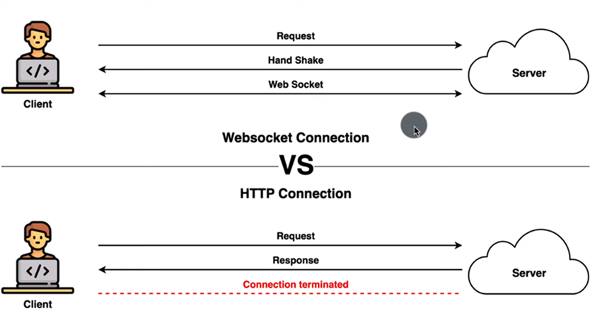
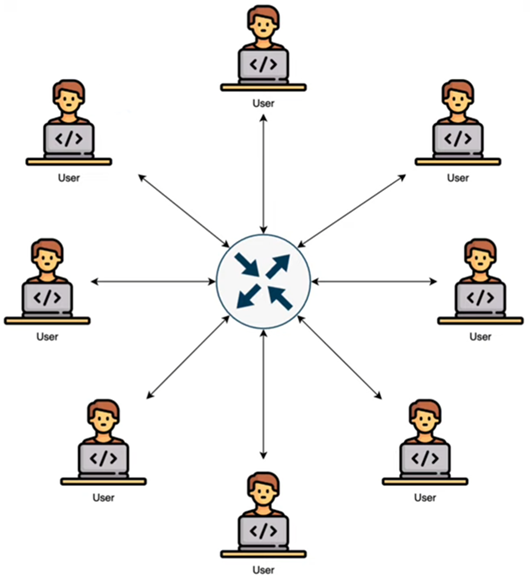

# [Spring boot y WebSockets: cree una aplicación de chat en tiempo real desde cero](https://www.youtube.com/watch?v=TywlS9iAZCM)

## ¿Qué es un webSocket?

Es un protocolo de comunicación que proporciona canales de comunicación `full duplex` a través de una única conexión
TCP, por lo que está diseñado para implementarse en navegadores web y servidores web, pero puede ser utilizado por
cualquier aplicación cliente o servidor.

`WebSocket` es un protocolo de red basado en `TCP` que establece cómo deben intercambiarse datos entre redes. Puesto que
es un protocolo fiable y eficiente, es utilizado por prácticamente todos los clientes. El protocolo `TCP` establece
conexiones entre dos puntos finales de comunicación, llamados sockets. De esta manera, **el intercambio de datos puede
producirse en las dos direcciones.**

Los `websockets` son un protocolo estándar definido en el `RFC 6455` en 2011 y es soportado por todos los navegadores
modernos. **Los websockets establecen una conexión bidireccional persistente entre el cliente y el servidor** en la capa
de aplicación. **También se utiliza una conexión TCP persistente en la capa de transporte.**

Los `webSockets`, así como el HTTP, funcionan en los puertos 80 y 443 si se utiliza la encriptación. Para los webSockets
hay un prefijo especial en la URL `ws/` que significa web sockets o `wss/` si los sockets se utilizan junto
con `SSL TLS` para el cifrado. La URL de los webSockets podría ser de esta forma: `ws://www/ccnadesdecero.es/chat`.

`Full duplex` se refiere a la capacidad de un sistema de comunicación para transmitir datos en ambas direcciones
simultáneamente. En otras palabras, en un sistema `full duplex`, los dispositivos pueden enviar y recibir datos al mismo
tiempo, lo que permite una comunicación bidireccional simultánea.

En el contexto de los `WebSockets`, esta capacidad de full duplex significa que tanto el cliente como el servidor pueden
enviar mensajes entre sí sin tener que esperar una respuesta antes de enviar más datos. Esto permite una comunicación
más fluida y en tiempo real entre el cliente y el servidor, lo que es especialmente útil para aplicaciones web
interactivas, juegos en línea, chats en vivo y otras aplicaciones que requieren una comunicación rápida y bidireccional.

## Ventajas de los webSockets

- `Real Time Data Transfer`, los webSockets son capaces de intercambiar datos en tiempo real en un sitio web o
  aplicación.


- `Bi-Directional`, permite una comunicación bidireccional, por lo que los datos en los webSockets siguen ambas
  direcciones, lo que significa que los servidores ahora pueden enviar datos al cliente cuando sea necesario. Esta es
  una gran mejora con respecto al protocolo tradicional HTTP donde la comunicación generalmente la iniciaba el cliente.


- `Efficient`, al igual que el protocolo HTTP, el protocolo webSockets no requiere que se envíen encabezados dentro de
  cada mensaje, por lo que esto da como resultado que se transfieran menos datos al crear webSockets, es más eficiente
  para aplicaciones en tiempo real que envían frecuentemente pequeños paquetes, como actualizaciones de juegos o
  aplicaciones de chat.


- `Persistent Connection`, para que la conexión entre el cliente y el servidor permanezcan abierta proporciona una
  conexión persistente, una vez establecida la conexión permanece abierta hasta que el cliente o el servidor decide
  cerrarlo, por lo que esta conexión persistente reduce significativamente la latencia en la transferencia de datos.

## Casos de uso para los webSockets

- Chat applications
- Real-Time Gaming
- Collaborative Editing
- Live Updates
- IoT (Internet of Things)

WebSocket no es un sustituto total de HTTP, pero puede usarse como canal de comunicación eficiente y bidireccional
siempre que se necesite dar o recibir información en tiempo real.

## [Protocolos WebSocket y STOMP](https://www.toptal.com/java/stomp-spring-boot-websocket)

El protocolo WebSocket le permite implementar comunicación bidireccional entre aplicaciones. **Es importante saber que
HTTP se utiliza sólo para el protocolo de enlace inicial. Una vez que esto sucede, la conexión HTTP se actualiza a una
conexión TCP/IP recién abierta que utiliza un WebSocket.**

El protocolo WebSocket es un protocolo de nivel bastante bajo. Define cómo un flujo de bytes se transforma en tramas. Un
marco puede contener un texto o un mensaje binario. Debido a que el mensaje en sí no proporciona ninguna información
adicional sobre cómo enrutarlo o procesarlo, es difícil implementar aplicaciones más complejas sin escribir código
adicional. Afortunadamente, la especificación WebSocket permite el uso de subprotocolos que operan en un nivel de
aplicación superior. Uno de ellos, respaldado por Spring Framework, es STOMP.

`STOMP` es un protocolo de mensajería simple basado en texto que se creó inicialmente para lenguajes de secuencias de
comandos como Ruby, Python y Perl para conectarse a intermediarios de mensajes empresariales. Gracias a STOMP, los
clientes y corredores desarrollados en diferentes idiomas pueden enviar y recibir mensajes entre sí. El protocolo
WebSocket a veces se denomina TCP para Web. Analógicamente, STOMP se llama HTTP para Web. Define un puñado de tipos de
tramas que se asignan a tramas de WebSockets, por ejemplo, CONECTAR, SUSCRIBIR, CANCELAR SUSCRIPCIÓN, ACK o ENVIAR. Por
un lado, estos comandos son muy útiles para gestionar la comunicación y, por otro, nos permiten implementar soluciones
con funciones más sofisticadas como el reconocimiento de mensajes.

## [Http Connection vs WebSocket Connection](https://www.ionos.es/digitalguide/paginas-web/desarrollo-web/que-es-websocket/)

**¿Cómo se accede a una página web sin WebSocket?** En Internet, la transmisión de páginas web suele realizarse mediante
una `conexión HTTP`. Este protocolo sirve para transmitir datos y hace posible la carga de las páginas web en el
navegador. Para lograrlo, el cliente envía, con cada acción del usuario (un clic, por ejemplo), una solicitud al
servidor.

Para acceder a una página web, en HTTP el cliente debe enviar primero una `solicitud al servidor`. Una vez enviada, el
servidor puede responder y mostrar el contenido solicitado. Se trata de un rígido patrón de solicitud y respuesta que
provoca, en última instancia, largos tiempos de espera entre la solicitud y la respuesta.



`El protocolo WebSocket` permitió por primera vez acceder a una web de forma dinámica en tiempo real. Con este
protocolo,
basta con que el cliente establezca una conexión con el servidor, que se confirma mediante el llamado apretón de manos
o `WebSocket Protocol Handshake`. Con él, el cliente envía al servidor todos los datos de identificación necesarios para
el intercambio de información.

**El canal de comunicación se queda, por así decirlo, abierto tras el handshake.** El servidor puede activarse por sí
mismo y poner toda la información a disposición del cliente, sin que este tenga que pedírselo. Las notificaciones push
de las páginas web también funcionan según este principio. Si el servidor dispone de nueva información, se lo comunica
al cliente, sin necesidad de recibir una solicitud específica para ello.

**Para iniciar el intercambio,** con WebSocket el cliente envía una solicitud, al igual que en el clásico HTTP. Sin
embargo, `la conexión se establece mediante TCP y permanece abierta tras el handshake entre el cliente y el servidor`,
que tiene la siguiente forma:

````bash
GET /chatService HTTP/1.1
Host: server.example.com
Upgrade: websocket
Connection: Upgrade
Sec-WebSocket-Key: dGhlIHNhbXBsZSBub25jZQ==
Sec-WebSocket-Origin: http://example.com
Sec-WebSocket-Protocol: chat, superchat
Sec-WebSocket-Version: 13
````

El servidor responde con código `HTTP 101`:

````bash
HTTP/1.1 101 Switching Protocols
Upgrade: WebSocket
Connection: Upgrade
Sec-WebSocket-Accept: s3pPLMBiTxaQ9kYGzzhZRbK+xOo=
Sec-WebSocket-Protocol: superchat
````

El nuevo esquema URL de WebSocket para las páginas web mostradas se define con el prefijo `ws` en lugar de `http`. El
prefijo que corresponde a una conexión segura es, entonces, `wss`, de forma análoga a `https`.

## Hand Shake

En el contexto de WebSockets, `handshake` (apretón de manos) se refiere al intercambio inicial de información entre el
cliente y el servidor para establecer una conexión WebSocket. Este proceso se realiza mediante un protocolo de handshake
específico que consta de varios pasos. Aquí hay un resumen de cómo funciona:

1. `Solicitud de apretón de manos (Handshake Request)`: El cliente envía una solicitud HTTP especial al servidor,
   indicando que desea iniciar una conexión WebSocket. Esta solicitud incluye encabezados específicos, como `Upgrade`
   y `Connection`, que indican la intención de actualizar la conexión a WebSocket.


2. `Respuesta de apretón de manos (Handshake Response)`: El servidor responde a la solicitud de apretón de manos con una
   respuesta HTTP que indica si acepta la actualización a WebSocket. Esta respuesta también incluye encabezados
   específicos, como `Upgrade`, `Connection` y `Sec-WebSocket-Accept`, que confirman la actualización y establecen
   parámetros para la conexión WebSocket.


3. `Conexión WebSocket establecida (WebSocket Connection Established)`: Si la respuesta del servidor es positiva y
   acepta la actualización a WebSocket, se considera que el handshake ha sido exitoso y se establece la conexión
   WebSocket. A partir de este punto, el cliente y el servidor pueden intercambiar datos en tiempo real a través de la
   conexión WebSocket.

**El proceso de handshake en WebSockets es crucial para establecer una conexión segura y confiable entre el cliente y
el servidor,** permitiendo la comunicación bidireccional de datos en tiempo real. Es importante tener en cuenta que el
handshake en WebSockets es un proceso específico que difiere de la forma en que se establecen las conexiones HTTP
tradicionales.

## Sobre el proyecto



Para este proyecto crearemos un webSocket message broker que desempeñará el papel de intermediario que recibirá
información de diferentes usuarios y enviaremos la misma información a los usuarios conectados. Cada vez que un usuario
se desconecte también enviaremos la información a los demás usuarios indicando que el usuario se ha desconectado o
ha abandonado el chat.

