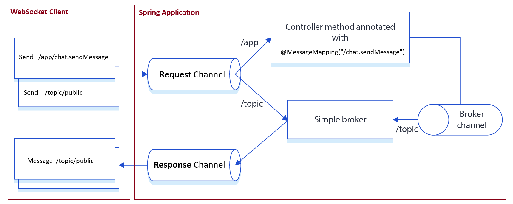

# WebSocket

---

## Dependencias

````xml
<!--Spring Boot 3.2.4-->
<!--Java 21-->
<dependencies>
    <dependency>
        <groupId>org.springframework.boot</groupId>
        <artifactId>spring-boot-starter-web</artifactId>
    </dependency>
    <dependency>
        <groupId>org.springframework.boot</groupId>
        <artifactId>spring-boot-starter-websocket</artifactId>
    </dependency>

    <dependency>
        <groupId>org.projectlombok</groupId>
        <artifactId>lombok</artifactId>
        <optional>true</optional>
    </dependency>
    <dependency>
        <groupId>org.springframework.boot</groupId>
        <artifactId>spring-boot-starter-test</artifactId>
        <scope>test</scope>
    </dependency>
</dependencies>
````

## Creando clase de configuración

Podemos configurar Spring para habilitar la mensajería `WebSocket` y `STOMP`:

````java

@Configuration
@EnableWebSocketMessageBroker
public class WebSocketConfig implements WebSocketMessageBrokerConfigurer {
    @Override
    public void registerStompEndpoints(StompEndpointRegistry registry) {
        registry.addEndpoint("/web-socket")
                .setAllowedOriginPatterns("*")
                .withSockJS();
    }

    @Override
    public void configureMessageBroker(MessageBrokerRegistry registry) {
        registry.enableSimpleBroker("/topic");
        registry.setApplicationDestinationPrefixes("/app");
    }
}
````

`@EnableWebSocketMessageBroker`, esta anotación habilita la infraestructura necesaria para el soporte de WebSocket y el
enrutamiento de mensajes WebSocket en Spring. Básicamente, **activa la funcionalidad de WebSocket en tu aplicación
Spring Boot.**

`WebSocketMessageBrokerConfigurer`, esta interfaz proporciona métodos para configurar la infraestructura de `WebSocket`
en tu aplicación.

`registerStompEndpoints()` configura el `endpoint de WebSocket` que **los clientes usarán para establecer la conexión
WebSocket con el servidor.** En este caso, se está registrando un endpoint llamado `/web-socket`. Además, `withSockJS()`
habilita el soporte `SockJS` para **permitir la compatibilidad con navegadores que no admiten completamente WebSocket.**

`.setAllowedOriginPatterns("*")` dentro del método `registerStompEndpoints()` es para especificar los orígenes
permitidos para las conexiones `WebSocket`. Esto es importante para la seguridad de tu aplicación, ya que ayuda a
prevenir ataques de tipo **Cross-Origin Resource Sharing (CORS)** al restringir qué orígenes pueden acceder a tus puntos
finales WebSocket. En este caso, el `*` establece un patrón que coincide con todos los orígenes, lo que significa que
cualquier origen puede acceder al endpoint de `WebSocket`. En un entorno de producción, es posible que desees ser más
restrictivo y especificar los orígenes permitidos de manera más precisa según las necesidades de seguridad de tu
aplicación.

El método `configureMessageBroker()` configura el broker de mensajes, habilitando un broker simple y definiendo los
prefijos para los destinos de mensajes. Este método hace dos cosas:

1. Crea el `message broker (intermediario de mensajes)` en memoria con uno o más destinos para enviar y recibir
   mensajes. En el código mostrado, hay un único prefijo de destino definido: `/topic`. Sigue la convención de que los
   destinos de los mensajes que se transmitirán a todos los clientes suscritos a través del modelo pub-sub deben tener
   el prefijo `topic`. Los mensajes enviados a `/topic` serán transmitidos a todos los clientes suscritos a ese
   tema.<br><br>

2. Define el prefijo `/app` que se utiliza para filtrar destinos manejados por métodos anotados con `@MessageMapping`
   que implementará en un controlador. El controlador, después de procesar el mensaje, lo enviará al `broker`. Los
   mensajes enviados a `/app` serán enrutados a los métodos de controlador de Spring.

[](https://www.toptal.com/java/stomp-spring-boot-websocket)

## Método con @EventListener para escuchar la desconexión de un usuario

Crearemos un componente que será un Listener, es decir contendrá un método anotado con `@EventListener`.

Cuando se usa `@EventListener`, Spring escanea automáticamente los métodos anotados en busca de aquellos que manejan
eventos específicos y los registra como listeners de eventos. Estos métodos pueden recibir como parámetro el evento que
están escuchando. En nuestro ejemplo, el evento que está escuchando nuestro método es `SessionDisconnectEvent`.

La anotación `@EventListener` marca al método como detector de eventos de la aplicación. Si un método anotado admite un
único tipo de evento, el método puede declarar un único parámetro que refleje el tipo de evento a escuchar.

Los eventos pueden ser instancias de `ApplicationEvent` así como objetos arbitrarios.

`SessionDisconnectEvent`, evento que se genera cuando se cierra la sesión de un cliente `WebSocket` que utiliza un
protocolo de mensajería simple (por ejemplo, STOMP) como subprotocolo WebSocket.

Tenga en cuenta que este evento puede generarse más de una vez para una sola sesión y, por lo tanto, los consumidores de
eventos deben ser idempotentes e ignorar un evento duplicado.

En el contexto de Spring Boot, el método está anotado con `@EventListener`, lo que indica que es un listener de eventos
de Spring. Además, está específicamente configurado para manejar eventos del tipo `SessionDisconnectEvent`.

El método `handleWebSocketDisconnectListener()` se ejecutará cuando se produzca un evento de desconexión de WebSocket en
la aplicación. Esto significa que **el método se activará automáticamente cada vez que un cliente WebSocket se
desconecte del servidor.**

````java

@Slf4j
@RequiredArgsConstructor
@Component
public class WebSocketEventListener {

    private final SimpMessageSendingOperations sendingOperations;

    // Informaremos a los usuarios de la aplicación que el usuario ha abandonado el chat
    @EventListener
    public void handleWebSocketDisconnectListener(SessionDisconnectEvent event) {
        StompHeaderAccessor headers = StompHeaderAccessor.wrap(event.getMessage());
        String username = (String) headers.getSessionAttributes().get("username");
        if (username != null) {
            log.info("Usuario desconectado: {}", username);
            ChatMessage chatMessage = new ChatMessage(null, username, MessageType.LEAVE);

            this.sendingOperations.convertAndSend("/topic/public", chatMessage);
        }
    }
}
````

`StompHeaderAccessor.wrap(event.getMessage())`, crea una instancia de esta clase a partir de un `payload` y los
encabezados del `Message` dado.

`event.getMessage()`, devuelve el mensaje asociado con el evento. A continuación se muestra un ejemplo de cómo
obtener información sobre la identificación de la sesión o cualquier encabezado en el mensaje:

````bash
StompHeaderAccessor headers = StompHeaderAccessor.wrap(message);
headers.getSessionId();
headers.getSessionAttributes();
headers.getPrincipal();
````

`headers.getSessionAttributes().get("username")`, obtenemos el valor del `username` que será agregado en el controlador.

`this.sendingOperations.convertAndSend("/topic/public", chatMessage)`, convierte el objeto dado a un formato
serializado, lo envuelve como un message y lo envía al destino especificado, en este caso `/topic/public`. **Esto puede
ser una forma de notificar a otros clientes conectados que un usuario ha dejado el chat.**

## Creando controlador ChatController

Antes de continuar con el controlador, es necesario crear un record y un enum que serán usados precisamente por los
métodos del controlador:

````java
public enum MessageType {
    CHAT,       // Cuando va a chatear
    JOIN,       // Cuando se va a unir a un chat
    LEAVE      // Cuando se desconecta del chat
}
````

````java
public record ChatMessage(String content, String sender, MessageType type) {
}
````

Ahora, sí continuamos con la clase de controlador y sus dos métodos:

````java

@Controller
public class ChatController {

    @MessageMapping("/chat.sendMessage")
    @SendTo("/topic/public")
    public ChatMessage sendMessage(@Payload ChatMessage chatMessage) {
        return chatMessage;
    }

    @MessageMapping("/chat.addUser")
    @SendTo("/topic/public")
    public ChatMessage addUser(@Payload ChatMessage chatMessage, SimpMessageHeaderAccessor headerAccessor) {
        // Agrega el username en la sesión de webSocket
        //headerAccessor.getSessionAttributes(), devuelve los atributos asociados con la sesión actual
        headerAccessor.getSessionAttributes().put("username", chatMessage.sender());
        return chatMessage;
    }
}
````

### Describiendo método sendMessage()

`@MessageMapping("/chat.sendMessage")`, con esta anotación decimos cuál es la URL que quiero usar para invocar el
método `sendMessage()`.

`@MessageMapping`, anotación para asignar un mensaje a un método de manejo de mensajes haciendo coincidir los patrones
declarados con un destino extraído del mensaje.

Los métodos anotados con `@MessageMapping` admiten los siguientes argumentos:

- `@Payload`, argumento del método para extraer el payload de un mensaje y de-serializarlo al tipo de destino declarado.
  Los argumentos `@Payload` también se pueden anotar con anotaciones de validación como `@Validated` y luego se les
  aplicará la validación `JSR-303`. Tenga en cuenta que **no es necesario que la anotación esté presente, ya que se
  asume de forma predeterminada para los argumentos que no se manejan de otra manera.**

  Cuando estamos trabajando con una aplicación `Rest`, normalmente usamos el `@RequestBody` para enlazar el contenido
  que viene en el cuerpo de la solicitud con la clase a asociar. Ahora, cuando hablamos de `WebSocket`, lo que debemos
  usar es el `@Payload`.

- `@DestinationVariable`, argumento del método para acceder a los valores de las variables de la plantilla extraídos del
  destino del mensaje, por ejemplo `/hoteles/{hotel}`. **Los valores de las variables también se pueden convertir
  de `String` al tipo de argumento del método declarado, si es necesario.**

Existen más argumentos: `@Header`, `@Headers`, `MessageHeaders`, etc.

> `@SendTo("/topic/public")`, a qué topic o a qué cola queremos enviar. Este topic proviene del
> método `configureMessageBroker()` de la clase `WebSocketConfig`, línea: `registry.enableSimpleBroker("/topic")`.

#### En resumen:

Cada vez que recibamos un mensaje a través del método `sendMessage()` y como por parámetro se está recibiendo
un `@Payload`, este se enviará **automáticamente** al topic `/topic/public`, es decir, se hará uso **automáticamente**
de la anotación `@SendTo("/topic/public")`, por lo que simplemente el payload que recibimos por parámetro lo retornamos.

En resumen, cuando queramos usar el método `sendMessage()` debemos llamar al endpoint `/chat.sendMessage` y
luego, cada vez que recibamos un mensaje o un `@Payload` se pondrá en cola en `/topi/public`.

### Describiendo método addUser()

En caso de que un nuevo usuario se una, el método `addUser()` nos permitirá establecer una conexión entre el `usuario`
y el `WebSocket`.